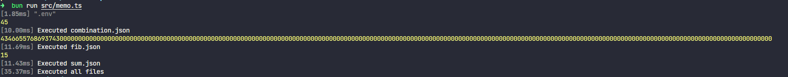

# 🐔 Interpreter/Compiler Binha 🐔

An implementation made in my beloved [Typescript](https://www.typescriptlang.org/). 

Using my new friend fresh out of the oven, [BunJS](https://bun.sh/)  creating the binha (bun + rinha). 

The project is to focus more on the bun itself and let it "drive itself", the project was kept as basic as possible, despite this, if the tests contain only pure functions, you have my secret letter.

You can confirm the details of the challenge [here](https://github.com/aripiprazole/rinha-de-compiler).   
Additionally, you can confirm the implementation specifications [here](https://github.com/aripiprazole/rinha-de-compiler/blob/main/SPECS.md).

The project was restructured, but it presented performance losses, around 50% of execution time, so it was not implemented in the solution.

# 🔗 Redes Sociais

- Github: [`@Pedromdsn`](https://github.com/Pedromdsn)
- Twitter/X: [`@PPedromdsn`](https://twitter.com/PPedromdsn)
- Website: [`pedromdsn.site`](https://pedromdsn.site)
